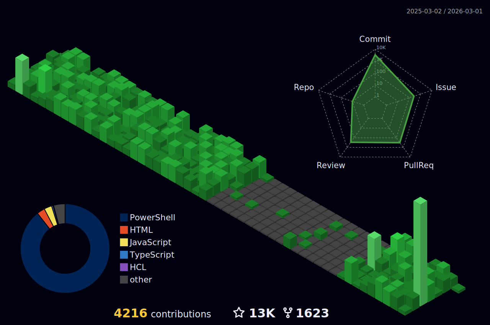

<h1 align="center">Hi 👋, I'm Farhan Ashraf</h1>
<h3 align="center">DevSecOps Engineer at Systems Ltd</h3>
<h3 align="center">Leveraging my background in computer science and passion for cybersecurity to drive innovation in DevSecOps.</h3>

  

<!-- 
 
--->

  

<ul>
		<li>🌱 I’m currently learning <strong>Python, kubernetes, Securing CI/CD pipelines</strong></li>
		<li>👨‍💻 All of my projects are available at <a href="https://devpost.com/mriceflame">https://devpost.com/mriceflame</a></li>
		<li>📝 I regularly write articles on <a href="https://blog.farhanashraf.dev">blog.farhanashraf.dev</a></li>
		<li>💬 Ask me about <strong>Docker, Kubernetes, DevSecOps, Cloud Security, Incident Response, Threat Intelligence.</strong></li>
		<li>📫 How to reach me <strong>mriceflame@protonmail.com</strong></li>
		<li>⚡ Fun fact <strong>I possess a penchant for humor that I believe rivals that of the most seasoned comedians. 😄</strong></li>
</ul>

<h3>Blogs posts</h3>
	<!-- BLOG-POST-LIST:START -->
	<ul>
		<li><a href="https://blog.farhanashraf.tech/how-to-install-discord-on-kali-linux-20211-and-other-linux-distributions">Threat Actors and the Attack Surface</a></li>
		<li><a href="https://blog.farhanashraf.tech/how-to-install-discord-on-kali-linux-20211-and-other-linux-distributions">How to install Discord on Kali Linux-20211 and other Linux Distributions</a></li>
		<li><a href="https://blog.farhanashraf.dev/haveibeenpwned-breach-heres-what-you-need-to-know-and-do">Your data got breached? what to do next?</a></li> 
		<li><a href="https://blog.farhanashraf.tech/get-aws-certified-for-free">Get AWS Certified For Free</a></li> 
	</ul>
	<!-- BLOG-POST-LIST:END -->
</body>
</html>

 
	<!-- BLOG-POST-LIST:END -->
<h3 align="left">Connect with me:</h3>

<h3 align="left">Languages and Tools:</h3>

            <a href="https://d3js.org/" target="_blank">                              

<h2><i>⚙️ GitHub Analytics</i></h2>

<!--    -->

<!--  -->

# Github Contributions
<h4 align="center">Isometric view of contributions in the last year</h4>

	

<h3 align="center">Github Metrics</h3>

	

     
    

<!-- <h3 align="left">Support:</h3>

  
  -->
