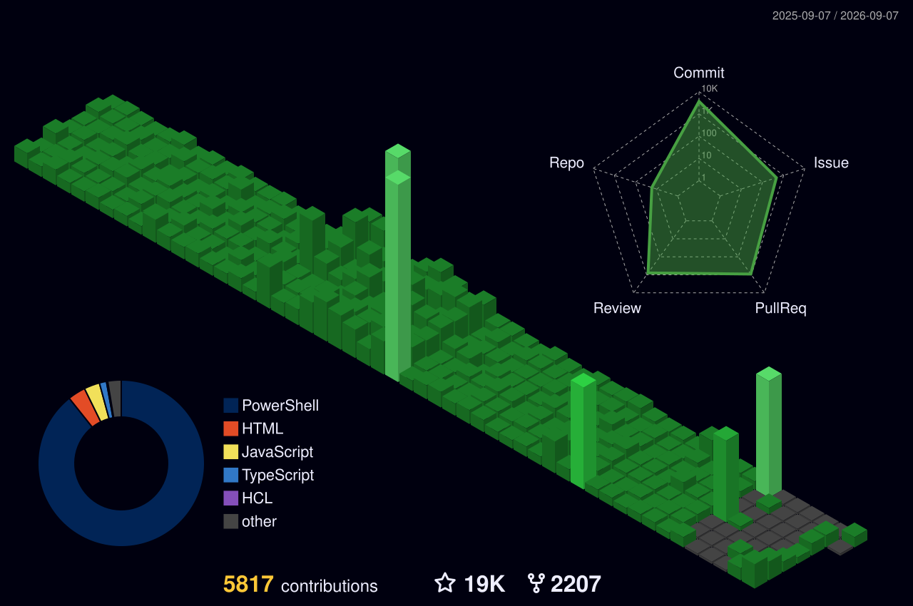

# Farhan Ashraf

### AI Security &amp; Cloud-Native Security Engineer @ Systems Limited

I build and secure GenAI infrastructure, Kubernetes platforms, and automated software delivery systems.

**19k★ open-source creator · AWS IA contributor · CNCF contributor · OWASP contributor · GitHub Campus Expert**

---

## Selected Open-Source Impact

Selected work framed as **Situation → Task → Action → Result**, with project-level reach separated from the direct outcome of each change.

### 🔐 [90DaysOfCyberSecurity](https://github.com/farhanashrafdev/90DaysOfCyberSecurity) — Creator

Open-source cybersecurity roadmap with **~19k GitHub stars** and **2.1k+ forks**.

- **Situation:** Cybersecurity beginners faced a broad, fragmented learning landscape without a practical sequence to follow.
- **Task:** Turn the core skills into an approachable, day-by-day path from fundamentals to hands-on security work.
- **Action:** Created and continue to maintain a free 90-day roadmap spanning networking, Linux, Python, traffic analysis, ELK, cloud, and ethical hacking.
- **Result:** The roadmap has earned sustained global discovery and community reuse.

 

### 🧠 AWS IA — [Terraform AWS Bedrock](https://github.com/aws-ia/terraform-aws-bedrock) → [Merged PR #162](https://github.com/aws-ia/terraform-aws-bedrock/pull/162)

Added Bedrock Guardrails image-filter support, improved typed schemas, and expanded Cloud Control resource support.

- **Situation:** The reusable module lacked image-filter guardrails and typed coverage for newer Bedrock Cloud Control resources, leaving configuration gaps and weaker validation.
- **Task:** Bring the module's guardrail and resource schemas in line with current Bedrock capabilities.
- **Action:** Added image-filter support, strongly typed guardrail inputs, automated-reasoning policies, and broader Cloud Control schema coverage.
- **Result:** Teams can define text and image safeguards with earlier validation and better IDE guidance; the capability now ships in a module with **[119k+ Terraform Registry downloads](https://registry.terraform.io/modules/aws-ia/bedrock/aws/latest)**.

### 🤖 AWS IA — [Terraform AWS AgentCore](https://github.com/aws-ia/terraform-aws-agentcore) → [Merged PR #20](https://github.com/aws-ia/terraform-aws-agentcore/pull/20)

Implemented gateway request/response Lambda interceptors, validation, outputs, and automatic invocation permissions.

- **Situation:** AgentCore gateways had no first-class Terraform support for request and response Lambda interceptors.
- **Task:** Make gateway-boundary controls reusable without requiring teams to wire Lambda access manually.
- **Action:** Implemented validated interceptor configuration, outputs, documentation, and automatic Lambda invoke permissions.
- **Result:** Teams can add authorization, payload transformation, PII masking, and policy enforcement at the gateway boundary through a module with **[21k+ Terraform Registry downloads](https://registry.terraform.io/modules/aws-ia/agentcore/aws/latest)**.

### 🔭 CNCF — [Inspektor Gadget](https://github.com/inspektor-gadget/inspektor-gadget) → [Merged PR #5721](https://github.com/inspektor-gadget/inspektor-gadget/pull/5721)

Fixed Prometheus discovery targeting the obsolete metrics listener port.

- **Situation:** The default Prometheus annotation targeted legacy port `2223` while the OpenTelemetry metrics listener used `2224`, sending discovery to the wrong endpoint.
- **Task:** Restore correct default metrics discovery and keep generated deployment paths aligned.
- **Action:** Corrected the scrape port and regenerated the Helm and `kubectl gadget deploy` manifests.
- **Result:** Default Prometheus discovery now targets the live metrics endpoint across both installation paths in a **2.9k+ star / 370+ fork** CNCF project whose instrumentation also **[underpins Microsoft Defender for Containers](https://techcommunity.microsoft.com/blog/microsoftdefendercloudblog/ebpf-powered-threat-protection-using-inspektor-gadget/4115873)**.

### 🛡️ OWASP — [DevSecOps Guideline](https://github.com/OWASP/DevSecOpsGuideline) → [Merged PR #98](https://github.com/OWASP/DevSecOpsGuideline/pull/98)

Fixed Windows-incompatible repository paths preventing complete checkouts.

- **Situation:** Legacy repository paths contained `|`, a Windows-reserved character that prevented a complete working-tree checkout on Windows.
- **Task:** Remove the contributor-access barrier without changing the guideline's content or breaking other platforms.
- **Action:** Renamed the invalid paths and updated the affected files consistently across the repository.
- **Result:** Windows users can now obtain a complete checkout, removing this prerequisite barrier to contribution — relevant on an OS reported by **[49.5% of professional-developer respondents](https://survey.stackoverflow.co/2025/technology/#1-operating-system)** in Stack Overflow's 2025 survey, for an OWASP project with **1.1k+ stars** and **260+ forks**.

> _Reach figures checked 1 September 2026. Downloads, stars, and forks indicate project scale — not the number of users who consumed a specific change._

---

## What I'm Building

### Mantis

Open-source AI security testing CLI for automatically red-teaming LLM applications across prompt injection, leakage, hallucination, and agent/tool exploitation.

<!-- TODO: replace the placeholder links below with the real Mantis URLs -->
[Repository](https://github.com/farhanashrafdev) • [Documentation](https://github.com/farhanashrafdev) • [Quick Start](https://github.com/farhanashrafdev)

---

## Engineering Focus

**AI Security · GenAI Guardrails · Kubernetes · Terraform · AWS · DevSecOps · Software Supply Chain Security · OpenTelemetry**

**Cloud &amp; Infrastructure**

**Security &amp; DevSecOps**

**Languages &amp; Tools**

📊 GitHub Metrics

 

    

📈 3D Contribution Graph

 

    

---

## Speaking &amp; Community

GitHub Campus Expert and technical speaker focused on cloud, security, open source, and developer education.

- **Tech Conferences** — Cloud, Security, and DevOps topics
- **University Events** — as a GitHub Campus Expert
- **Meetups &amp; Workshops** — hands-on security training

> 💡 *Interested in having me speak at your event? [Reach out.](mailto:farhanashrafdev@protonmail.com)*

---

## Contact

Available for selected engineering, open-source, and speaking collaborations.

