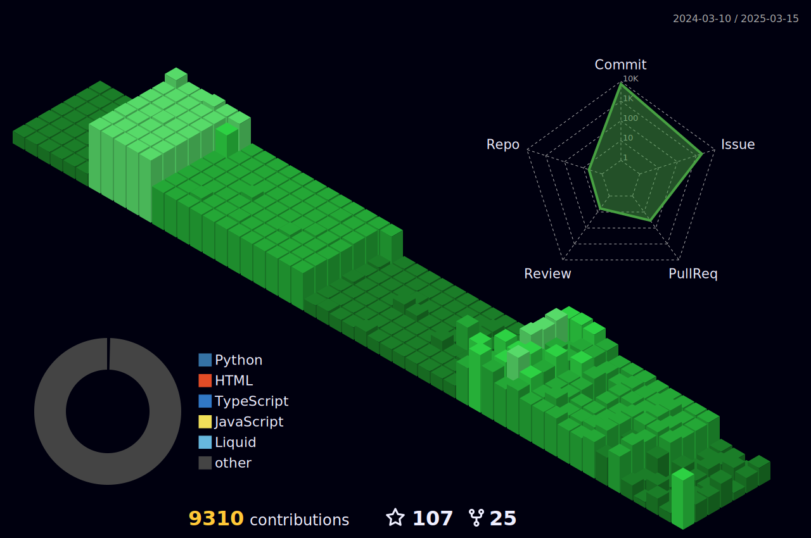

<h1 align="center">Hi 👋, I'm Farhan Ashraf</h1>
<h3 align="center">DevSecOps Engineer at Systems Ltd</h3>
<h3 align="center">Leveraging my background in computer science and passion for AI and Cloud Native Technologies to drive innovation in DevOps/MLOps.</h3>

    

<!--

    

-->

<ul>
    <li>🌱 I’m currently learning <strong>Python, Kubernetes, Securing CI/CD pipelines</strong></li>
    <li>👨‍💻 All of my projects are available at <a href="https://devpost.com/mriceflame">https://devpost.com/mriceflame</a></li>
    <li>📝 I regularly write articles on <a href="https://blog.farhanashraf.dev">blog.farhanashraf.dev</a></li>
    <li>💬 Ask me about <strong>Docker, Kubernetes, DevOps</strong></li>
    <li>📫 How to reach me <strong>mriceflame@protonmail.com</strong></li>
    <li>⚡ Fun fact <strong>I possess a penchant for humor that I believe rivals that of the most seasoned comedians. 😄</strong></li>
</ul>

<h3>Blogs posts</h3>
<ul>
    <li><a href="https://blog.farhanashraf.tech/how-to-install-discord-on-kali-linux-20211-and-other-linux-distributions">Threat Actors and the Attack Surface</a></li>
    <li><a href="https://blog.farhanashraf.tech/how-to-install-discord-on-kali-linux-20211-and-other-linux-distributions">How to install Discord on Kali Linux-20211 and other Linux Distributions</a></li>
    <li><a href="https://blog.farhanashraf.dev/haveibeenpwned-breach-heres-what-you-need-to-know-and-do">Your data got breached? what to do next?</a></li> 
    <li><a href="https://blog.farhanashraf.tech/get-aws-certified-for-free">Get AWS Certified For Free</a></li> 
</ul>

<h3 align="left">Connect with me:</h3>

    
    
    <!-- Add other social media links here -->

<h3 align="left">Languages and Tools:</h3>
<!-- Add your list of languages and tools here -->

<h2><i>⚙️ GitHub Analytics</i></h2>

    
     

# GitHub Contributions
<h4 align="center">Isometric view of contributions in the last year</h4>

    

<h3 align="center">GitHub Metrics</h3>

    

    

<h3 align="left">Support:</h3>

    

